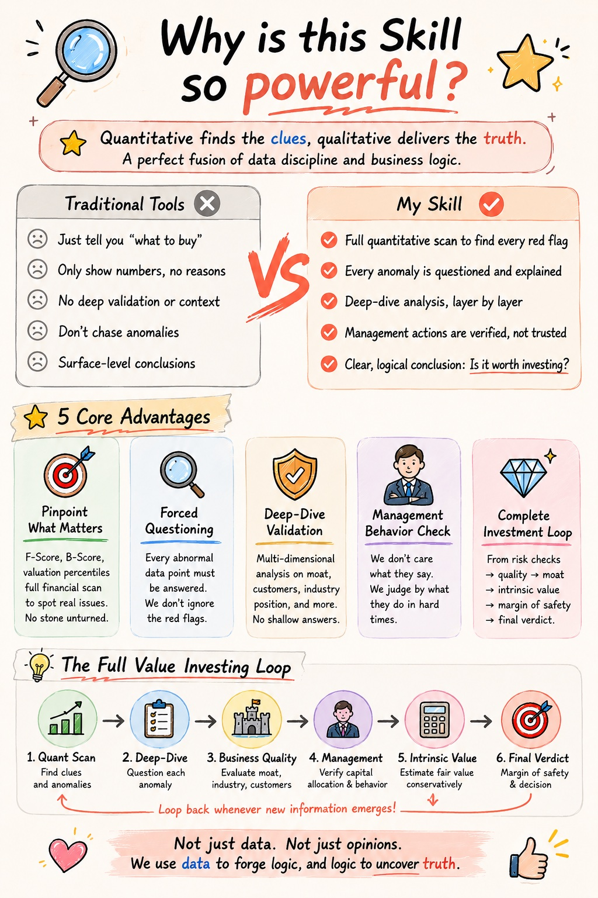
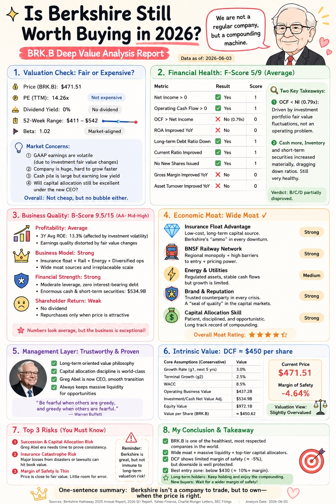
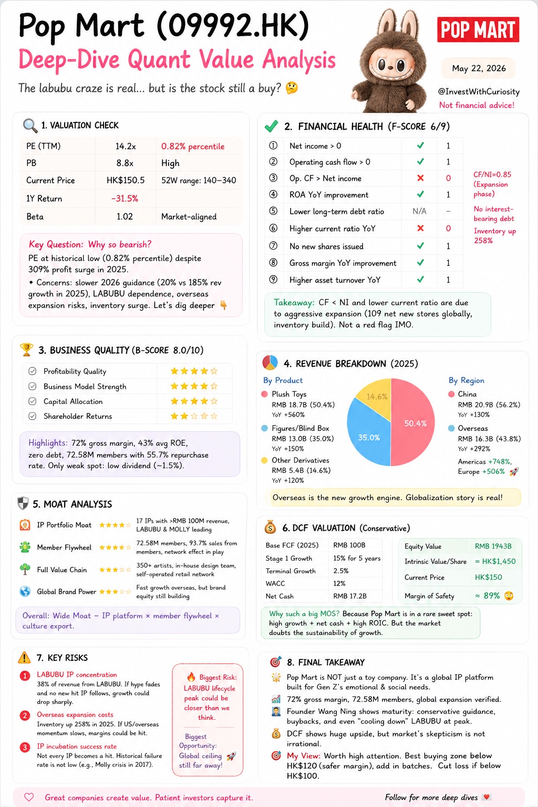
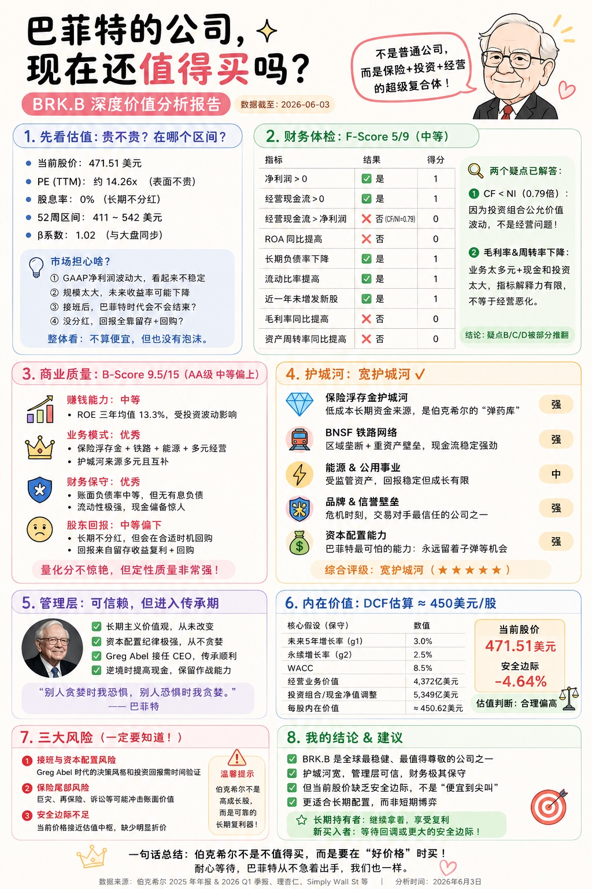
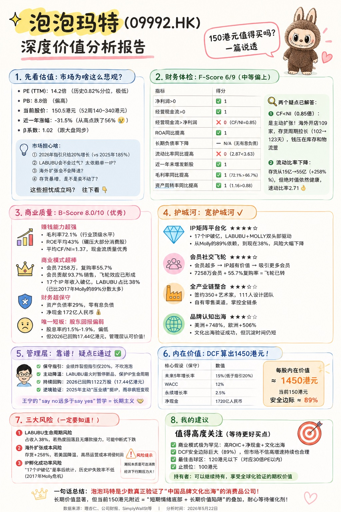

# Quant Value Analyzer Skill

Codex skill for listed-company quantitative value analysis, with a China A-share first workflow and support for other public equities when comparable public data is available. It combines F-Score financial risk screening, B-Score business quality scoring, doubt tracking, moat analysis, management verification, and two-stage DCF valuation.

This repository is adapted from a Coze skill package into a portable Codex skill format so other agents can install and reuse it.

> Research and education only. This skill is not financial advice, investment advice, or a recommendation to buy or sell securities.

## Quick Start

Install the skill into Codex:

```bash
python3 ~/.codex/skills/.system/skill-installer/scripts/install-skill-from-github.py \
  --repo wangzehao661-commits/quant-value-analyzer-skill \
  --path skills/quant-value-analyzer
```

Restart Codex, then ask:

```text
Use $quant-value-analyzer to analyze Berkshire Hathaway Class B (BRK.B) with the latest annual report, F-Score, B-Score, doubt tracking, and conservative DCF valuation.
```

For Chinese users:

```text
用 $quant-value-analyzer 分析 600519 贵州茅台，结合最新年报、F-Score、B-Score、疑点跟踪和保守 DCF 估值。
```

The running agent needs current public financial data. If browsing or market-data access is unavailable, provide the latest annual report, quarterly report, valuation metrics, and market price manually.

## Who This Is For

Use this skill if you want:

- A repeatable value-investing analysis workflow for public companies.
- A structured way to combine financial screening, business quality, doubts, moat, management and valuation.
- Bilingual Chinese/English outputs for research notes or investment-study practice.
- A portable Codex skill that other agents can install and reuse.

Do not use it as:

- A stock-picking signal by itself.
- A substitute for your own due diligence.
- A promise of future returns.
- A recommendation to buy, hold or sell any security.

## What It Does

- Runs a structured listed-company value analysis workflow.
- Calculates Piotroski F-Score for financial risk screening.
- Calculates quantitative and full B-Score for business quality.
- Tracks doubts raised by quantitative signals and requires qualitative closure.
- Estimates intrinsic value using a two-stage free cash flow DCF model.
- Produces a consistent final investment analysis report template.

## Language Support

The skill source is bilingual-friendly:

- Chinese users can ask in Chinese and receive Chinese reports.
- English users can ask in English and receive English reports.
- By default, the skill should answer in the user's language unless a target language is specified.

The current detailed workflow inside `SKILL.md` is written primarily in Chinese because the original Coze package targeted Chinese value-investing analysis. Modern coding agents such as Codex can still use it from English prompts; see the examples below.

## Repository Structure

```text
examples/
skills/
  quant-value-analyzer/
    SKILL.md
    agents/openai.yaml
    references/
    scripts/
```

## Install In Codex

From a machine with access to this public GitHub repository:

```bash
python3 ~/.codex/skills/.system/skill-installer/scripts/install-skill-from-github.py \
  --repo wangzehao661-commits/quant-value-analyzer-skill \
  --path skills/quant-value-analyzer
```

Restart Codex after installation so the skill is picked up. This repeats the Quick Start install command for readers who jump directly to the install section.

## Use

Ask Codex for a deep value analysis of a listed company, for example:

```text
Use $quant-value-analyzer to analyze 600519 贵州茅台 with the latest annual report, F-Score, B-Score, doubt tracking, and conservative DCF valuation.
```

```text
Use $quant-value-analyzer to analyze Berkshire Hathaway Class B (BRK.B) with the latest annual report, F-Score, B-Score, doubt tracking, and conservative DCF valuation.
```

The skill requires current public financial data. If the running agent cannot browse or access market data, provide the latest annual report, quarterly report, valuation metrics, and market price manually.

## Examples

- [Sample prompts](examples/sample-prompts.md)
- [Short output preview](examples/output-preview.md)
- [Berkshire Hathaway Class B validation example](examples/brkb-analysis.md)
- [Pop Mart validation example](examples/popmart-analysis.md)

## Visual Examples

### Why This Skill Is Useful

| English | 中文 |
|---|---|
|  |  |

### Case Studies

| Berkshire Hathaway | Pop Mart |
|---|---|
|  |  |

Chinese versions:

| 伯克希尔 | 泡泡玛特 |
|---|---|
|  |  |

## Scripts

All scripts use the Python standard library only.

```bash
python3 skills/quant-value-analyzer/scripts/f_score.py --help
python3 skills/quant-value-analyzer/scripts/b_score_quant.py --help
python3 skills/quant-value-analyzer/scripts/b_score_full.py --help
python3 skills/quant-value-analyzer/scripts/dcf_valuation.py --help
```

## Disclaimer

This skill is for research and education only. It is not financial advice, investment advice, or a recommendation to buy or sell securities.

## License

Apache-2.0. Redistributed versions should retain the `NOTICE` file attribution.
